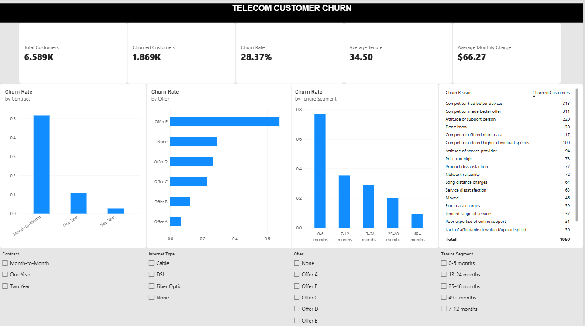
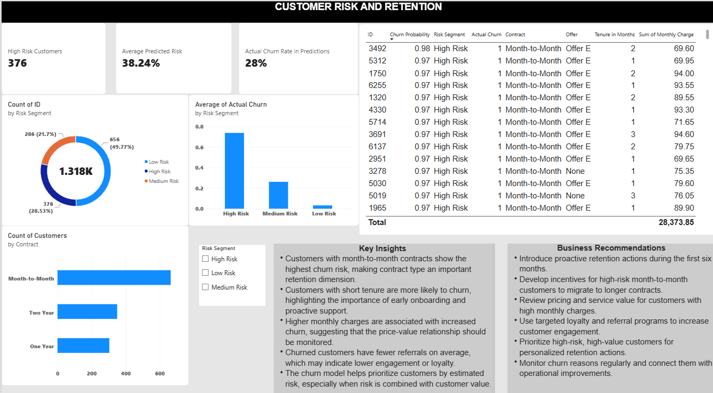

# Telecom Customer Churn Analysis

## Project overview

This project analyzes customer data to identify factors linked to churn and build a machine learning model that estimates the probability of customer churn.

The project combines:

* Data cleaning with Python
* Exploratory data analysis
* Statistical analysis
* SQL analysis with PostgreSQL
* Machine learning
* Power BI dashboards
* Business insights and recommendations

The main goal is to help a telecom company identify customers who may leave and prioritize retention actions.

## Business Questions

This project focuses on the following questions:

1. What percentage of customers have churned?
2. Which customer groups have the highest churn rate?
3. How does churn vary by contract type?
4. Are customers with shorter tenure more likely to churn?
5. Is monthly charge related to churn?
6. Which offers and services are associated with higher churn?
7. What are the most common reasons for customer churn?
8. Can machine learning help identify customers at risk of leaving?
9. How can the company use these results to improve customer retention?

## Original Dataset

* **Rows:** 7,043
* **Columns:** 43
* **Customer information:** age, marital status, dependents, location
* **Service information:** phone, internet, security, streaming and support services
* **Contract information:** contract type, offer and payment method
* **Financial information:** monthly charges, total charges, refunds and revenue
* **Churn information:** customer status, churn category and churn reason

### Main Columns

| Column                  | Description                             |
| ----------------------- | --------------------------------------- |
| `Customer ID`         | Unique customer identifier              |
| `Age`                 | Customer age                            |
| `Tenure in Months`    | Number of months with the company       |
| `Contract`            | Contract type                           |
| `Offer`               | Offer received by the customer          |
| `Internet Type`       | Type of internet service                |
| `Monthly Charge`      | Monthly customer charge                 |
| `Total Revenue`       | Total revenue generated by the customer |
| `Number of Referrals` | Number of customer referrals            |
| `Customer Status`     | Joined, Stayed or Churned               |
| `Churn Category`      | General churn category                  |
| `Churn Reason`        | Reported reason for churn               |

## Tools and Technologies

* **Python**
  * pandas
  * NumPy
  * Matplotlib
  * Seaborn
  * SciPy
  * scikit-learn
  * joblib
* **SQL**
  * PostgreSQL
  * pgAdmin
* **Business Intelligence**
  * Power BI
* **Development Tools**
  * Jupyter Notebook
  * Visual Studio Code
  * GitHub

## Data Cleaning

The first notebook prepares the dataset for analysis and modeling.

### Main Cleaning Steps

* Checked the number of rows and columns
* Reviewed data types
* Checked missing values
* Checked duplicate records
* Reviewed categorical values
* Checked numerical values and possible outliers
* Created a churn flag
* Created customer segments
* Checked revenue consistency

**Negative Monthly Charges**

The dataset contained 120 negative values in the `Monthly Charge` column.

These values were treated as data-quality issues:

* The original records were kept
* A new column called `Invalid Monthly Charge` was created
* Negative monthly charges were replaced with missing values
* The affected records were not deleted
* The new quality flag was not used as a machine learning feature

This approach keeps the original customer records while preventing invalid values from affecting the analysis.

## Exploratory Data Analysis

The analysis focuses on customers with the following statuses:

* Stayed
* Churned

Customers with the status `Joined` were excluded from the churn analysis because they had not yet reached a final churn or retention outcome.

## Analysis Population

* **Total customers analyzed:** 6,589
* **Stayed customers:** 4,720
* **Churned customers:** 1,869
* **Churn rate:** 28.37%

### Main Findings

**Contract Type**

Contract type showed the strongest association with churn among the categorical variables.

Month-to-month customers were more likely to churn than customers with one-year or two-year contracts.

**Business implication:**
Month-to-month customers should be monitored closely and may benefit from contract migration offers or targeted retention campaigns.

**Customer Tenure**

Churned customers had much shorter tenure than customers who stayed.

| Customer Status | Average Tenure |
| --------------- | -------------- |
| Churned         | 17.98 months   |
| Stayed          | 41.04 months   |

The 0–6 month segment had a particularly high churn rate.

**Business implication:**
The company should focus on onboarding, early support and customer satisfaction checks during the first months of the customer relationship.

**Monthly Charge**

Churned customers had higher average monthly charges than customers who stayed.

| Customer Status | Average Monthly Charge |
| --------------- | ---------------------- |
| Churned         | 74.62                  |
| Stayed          | 62.96                  |

**Business implication:**
The company should review the price-value relationship for customers with higher monthly charges.

**Customer Referrals**

Churned customers had fewer referrals on average.

| Customer Status | Average Referrals |
| --------------- | ----------------- |
| Churned         | 0.52              |
| Stayed          | 2.61              |

**Business implication:**
Referral activity may be a useful sign of customer engagement and loyalty. Referral and loyalty programs could be tested as part of the retention strategy.

**Age**

Churned customers were slightly older on average than customers who stayed.

| Customer Status | Average Age |
| --------------- | ----------- |
| Churned         | 49.74       |
| Stayed          | 45.58       |

Age showed a weaker relationship with churn than contract type, tenure or referrals.

**Business implication:**
Age can be used as a supporting segmentation variable, but it should not be the main basis for retention decisions.

**Gender**

Gender showed no meaningful association with churn in this analysis.

**Business implication:**
Gender should not be treated as a main churn driver based on these results.

### Statistical Analysis

The following methods were used:

* Mann–Whitney U tests for numerical variables
* Chi-square tests for categorical variables
* Cramér’s V to measure the strength of categorical associations
* Correlation analysis

The statistical results showed significant differences between churned and retained customers for several numerical variables.

However, statistical significance does not prove causation. The results show associations that may help explain customer churn.

## SQL Analysis

PostgreSQL was used to organize and analyze the data.

**SQL Tasks**

The SQL part of the project includes:

* Creating a staging table
* Loading the cleaned dataset
* Creating normalized tables
* Adding primary and foreign keys
* Creating analytical views
* Calculating churn KPIs
* Comparing churn by contract and offer
* Analyzing churn by tenure and age
* Analyzing revenue by customer segment
* Reviewing churn reasons
* Identifying high-risk customer groups

## Machine Learning

A machine learning model was developed to estimate customer churn risk.

**Target Variable**

The target variable is:

```
Churn Flag
```

Values:

* `0` = Stayed
* `1` = Churned

Customers with the status `Joined` were excluded from the modeling dataset.

**Features Used**

The model uses customer, service and contract information, including:

* Age
* Number of Dependents
* Tenure in Months
* Number of Referrals
* Monthly Charge
* Average Monthly GB Download
* Average Monthly Long Distance Charges
* Contract
* Offer
* Internet Service
* Internet Type
* Payment Method
* Phone Service
* Multiple Lines
* Online Security
* Online Backup
* Device Protection Plan
* Premium Tech Support
* Streaming TV
* Streaming Movies
* Streaming Music
* Unlimited Data
* Paperless Billing
* Married

**Features Excluded**

The following columns were excluded to prevent data leakage or avoid using information that would not be available for a future churn prediction:

```
Customer ID
Customer Status
Churn Category
Churn Reason
Invalid Monthly Charge
```

The churn category and churn reason were excluded because they describe the outcome after a customer has already churned.

### Data Preparation

The modeling process included:

* Train-test split
* Stratification by churn status
* Median imputation for numerical values
* Most-frequent imputation for categorical values
* Standardization of numerical features
* One-hot encoding of categorical features

The data was split into:

* **Training set:** 5,271 rows
* **Test set:** 1,318 rows

The test set was not used to train the model.

### **Final Model**

The Random Forest model was selected as the final model because it provides a good balance between:

* Recall
* Precision
* F1 score
* ROC-AUC
* PR-AUC

The final Random Forest model achieved approximately:

* **Accuracy:** 83.0%
* **Precision:** 66.0%
* **Recall:** 82.6%
* **F1 Score:** 73.4%
* **ROC-AUC:** 92.2%
* **PR-AUC:** 84.4%

### Feature Importance

The most important features in the Random Forest model were:

1. Contract
2. Tenure in Months
3. Number of Referrals
4. Number of Dependents
5. Internet Service
6. Monthly Charge
7. Online Security
8. Premium Tech Support
9. Offer
10. Payment Method

### Customer Risk Segmentation

The model generates a churn probability for each customer in the test set.

Customers are grouped into three risk segments:

| Churn Probability | Risk Segment |
| ----------------- | ------------ |
| 0–30%            | Low Risk     |
| 30–60%           | Medium Risk  |
| 60–100%          | High Risk    |

These thresholds are used as a simple business prioritization method.

The risk segments can help the company:

* Identify customers who may need attention
* Prioritize retention activities
* Compare actual churn rates across risk groups
* Focus on high-risk customers with higher customer value

The model should be used as a prioritization tool, not as a final decision by itself.

## Power BI Dashboard

The Power BI dashboard is designed to be simple and focused on business questions.

### **Dashboard Page 1 — Churn Overview**



The first page includes:

**KPI Cards**

* Total Customers
* Churned Customers
* Churn Rate
* Average Tenure
* Average Monthly Charge

**Main Visuals**

* Churn Rate by Contract
* Churn Rate by Tenure Segment
* Churn Rate by Offer
* Churn Rate by Monthly Charge Segment
* Top Churn Reasons

**Filters**

* Contract
* Internet Type
* Offer
* Tenure Segment

This page helps users understand the main patterns in customer churn.

### Dashboard Page 2 — Customer Risk and Retention

The second page uses the customer prediction file.



It includes:

* Number of high-risk customers
* Average predicted churn risk
* Customers by risk segment
* Actual churn rate by risk segment
* High-risk customers by contract
* High-risk customer table

The customer table includes information such as:

* Customer ID
* Churn Probability
* Risk Segment
* Contract
* Tenure in Months
* Monthly Charge
* Offer
* Number of Referrals

This page helps the company prioritize customers for possible retention actions.

## Business Recommendations

Based on the analysis, the company could consider the following actions:

1. **Improve Early Customer Retention**

Focus on customers during the first six months through:

Better onboarding
Proactive customer support
Satisfaction checks
Early issue resolution

2. **Monitor Month-to-Month Customers**

Identify month-to-month customers with high churn probability and consider:

Contract migration incentives
Personalized offers
Loyalty benefits
Retention communication

3. **Review High Monthly Charges**

Analyze whether customers with higher monthly charges receive enough value from their services.

**Possible actions include:**

* Reviewing pricing plans
* Offering better plan matches
* Checking service usage
* Providing targeted discounts when appropriate

4. **Increase Customer Engagement**

Use referral and loyalty programs to improve customer engagement.

The company could monitor whether increased engagement is linked to better retention over time.

5. **Use Churn Reasons for Operational Improvements**

Review the most common churn reasons and connect them with:

* Customer support improvements
* Service quality initiatives
* Payment process improvements
* Product and offer changes

## Limitations

This project has several limitations:

* The dataset is fictional.
* The data represents customers from one company and one geographic area.
* The analysis shows associations, not causal relationships.
* The churn model was evaluated on a holdout test set.
* Risk thresholds were selected as simple business rules, not optimized for a specific retention budget.
* Total revenue is strongly related to tenure and should not be treated as an independent churn driver.
* Model predictions should be reviewed together with business context before taking action.

## Conclusion

This project shows how customer data can be used to understand churn and support retention decisions.

The analysis found that contract type, tenure, referrals and monthly charges are important dimensions when studying churn. The Random Forest model achieved strong predictive performance and generated individual churn probabilities that can be used to prioritize customers.

The Power BI dashboard presents the main findings in a clear format and connects the analysis with practical business recommendations.

## Author

**Stela Munteanu**

Aspiring **Junior Data Analyst / Junior Business Analyst**

Interested in data analysis, business intelligence, SQL, Python, Power BI, and data-driven decision making.
